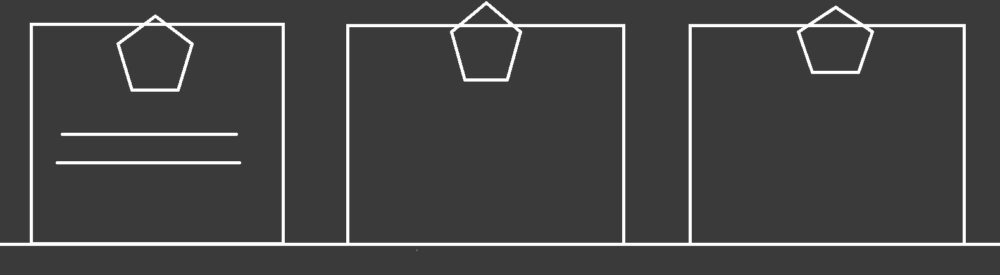

# Resume
[This here is my resume.](https://besartelezi.github.io/portfolio/) 
It's perfect place where employers will find out the reasons to hire me.
It will also be a small challenge for me coding wise.
I want to try out different things on Javascript that I'm not familiar with, mostly making animations.
It might also be a nice idea to have different pages on the resume.

Before starting out with the resume, I will make a list of things I'd like the resume to have, both coding and content wise.

## Content 
I have dabbled quite a bit with making resumes, be it for myself, or for friends and family.
But this will be the first time that I will make a resume website!

So I'll start out by writing down what pages I will add to the website and what kind of information that page should have.

### Homepage
This is where I will write down everything about me as a person. 
What you can do as a programmer is definitely important, but what kind of person you are is, to me, the most important thing.
I've read somewhere before that: 'Everyone can learn to be a good programmer, but not everyone can learn to be a good person'!

The page needs to have:
- [ ] A picture of 'le moi'
    - [x] Layout
    - [x] Content
    - [ ] Style
- [ ] A small introduction
    - [x] Layout
    - [x] Content
    - [ ] Style
- [ ] Why I want to work in IT
    - [x] Layout
    - [ ] Content
    - [ ] Style
- [ ] Obligatory BeCode Promotion Part of the Resume
    - [x] Layout
    - [ ] Content
    - [ ] Style
    - Links to other page on the website, where I talk a bit about some projects I have already made. 
    - Explain why this experience can differentiate me from other potential employees.

The BeCode part of the site will have this layout: 

Then comes this segment:
- [ ] My personal skills
    - [x] Layout
    - [ ] Content
    - [ ] Style
    - Includes Language

Here comes the spicy part, and I shall call this creation the 'Professional SkillBox':
- [ ] professional skills
  - [ ] Create a box, where all my skills are in.
  - [ ] The words need to be jumbled all together without order
  - [ ] Constantly move randomly
  - [ ] The colour keeps changing without stopping
  - [ ] Clicking/hovering over a word, lets it grow, and it stays in place.
  - [ ] When clicking on a button, all words in the box will be ordered perfectly and the page visitor can read them in a more calm way.
    - [ ] If possible, have it animated so the visitor can see the words run to their respective positions from their random ones, while also changing colours/sizes if needed.
  - Link to GitHub, so the employers can see for their selves if my current programming/coding abilities lie where they desire.

I have never made something like the Professional SkillBox, and I'd like to keep evolving it.
I might even need to use OOP for this if necessary.

### Experience
- [ ] My education/work experiences
    - [ ] Layout
    - [ ] Content
    - [ ] Style

### Coding/Projects/Programming Page (Still unsure of the title bit I'll get there)
At the start of the page, immediately link to my GitHub.
This page will contain some screenshots of projects I made, some text describing the projects, and links to the GitHub repositories and the projects themselves.
The projects I want to show off are:

- [ ] The Pokédex
  - What can I say, I just love Pokémon
- [ ] WeCode
  - It was a group project of a website for a fictional company.
- [ ] Cookie Clicker
- [ ] Blackjack on JS
- [ ] Rock, Paper, Scissors, Lizard, Spock

### Contact Page
This is where employers can find all my contact information.

- [ ] I'd like to add an e-mail form here.
- [ ] Show my e-mail address, phone number, the city I live in, that I have a temporary license B (I can drive by myself, I just still need to take the practical exam), maybe add social media links as well.

## To Code or Not To Code, That's Not Even a Good Question Of Course I Need To Code What Else Am I Getting Paid For?
Here are some things I'd like the resume website to have.
These things can change over time of course.
I might add some new things, remove/rewrite some old ones, I think it's important to remain adaptable and open to all the possibilities.

- [ ] **R E S P O N S I V E**
- [ ] Light and Dark Mode
  - Because I just love dark mode.
- [ ] Animations
  - Because I just love anime.
- [ ] Language button
  - The user can only select English and Dutch, since those are the languages I'm most fluent in.

### Header
Links to the different pages, but make it *r e s p o n s i v e*!
It also needs to have a light/darkmode switch button.
### Footer
Copyright by Besart Elezi.
I will also research other footers and see what I can add here.
* Social Links/Link to Github
* Let the user switch between Dutch and English.

## Goodbye preparation, hello actually making stuff!
With my lil' to do list done, I can finally focus on making the resume itself.
The very first thing I did was look for what colours I'd like to use for the website itself.
I know that I want to have a dark and light mode, so I chose these two colours just to start with:
* Ivory: #f6f7eb
* Onyx: #393e41
* Charleston Green: #26292C

### Topmojo's TOP 5 REASONS WHY YOU SHOULD HIRE BESART ELEZI
1. I have a Bachelor's degree in Communicationmanagement: Branding & Advertising.
   This means that I have the discipline and motivation to achieve my goals. 
   It also means that I have experience in marketing, branding, and graphic design.
   When making websites, I can coordinate better with the marketing department or analyse the Google Analytics to know how to further improve the website.
2. Experience in Digital Marketing.
3. Not afraid to make mistakes **(AND LEARN FROM THEM)**
4. I can be funny sometimes.
5. Creativity is my second name!
   Actually, I don't have a second name.
   But, if you hire me I will consider changing my middle name to 'Creativity'.
6. I'm very good at math!

